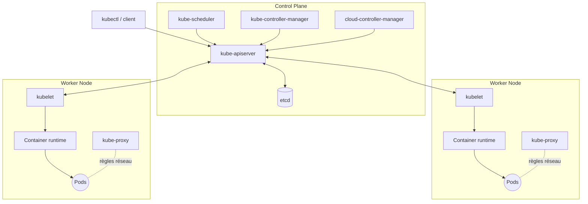

# Architecture Kubernetes

## Contexte

Un cluster Kubernetes est composé de deux types de machines : les nœuds du **control plane**
(qui pilotent le cluster) et les **worker nodes** (qui exécutent les charges de travail).
Comprendre ce découpage est la base pour diagnostiquer n'importe quel problème (pourquoi un
pod ne démarre pas, pourquoi le scheduling échoue, pourquoi l'API ne répond plus, etc.).

## Notes

### Vue d'ensemble

### Composants du control plane

- **kube-apiserver** : point d'entrée unique de l'API Kubernetes (REST). Toutes les
  interactions (kubectl, controllers, kubelet) passent par lui. Stateless, scalable
  horizontalement.
- **etcd** : base de données clé-valeur distribuée, stocke l'état complet du cluster
  (source de vérité). Un etcd corrompu ou perdu = cluster perdu → sauvegardes critiques.
- **kube-scheduler** : assigne les pods non planifiés à un nœud, selon les ressources
  disponibles, les contraintes (affinity, taints/tolerations, resource requests).
- **kube-controller-manager** : fait tourner les boucles de contrôle (control loops) qui
  rapprochent l'état réel de l'état désiré (ex. controller de Deployment, de Node, de Job).
- **cloud-controller-manager** : fait l'interface avec le cloud provider (Azure, AWS...)
  pour les LoadBalancer, volumes, et labels de nœuds spécifiques au cloud.

### Composants des worker nodes

- **kubelet** : agent sur chaque nœud, communique avec l'apiserver, s'assure que les
  conteneurs décrits dans les PodSpecs tournent et sont en bonne santé (probes).
- **kube-proxy** : maintient les règles réseau sur le nœud (iptables/IPVS) pour permettre
  la communication vers les Services.
- **Container runtime** : exécute réellement les conteneurs (containerd, CRI-O), via
  l'interface CRI (Container Runtime Interface).

### Principe clé : reconciliation loop

Tout Kubernetes fonctionne sur un modèle déclaratif : on décrit un **état désiré** (manifest
YAML appliqué via l'API), et des controllers comparent en continu cet état désiré à l'état
réel observé, puis appliquent les actions nécessaires pour converger. C'est ce mécanisme qui
explique la résilience de K8s (un pod tué est automatiquement recréé par le controller du
Deployment, par exemple).

## Références

- [Kubernetes Components (doc officielle)](https://kubernetes.io/docs/concepts/overview/components/)
- [etcd documentation](https://etcd.io/docs/)
