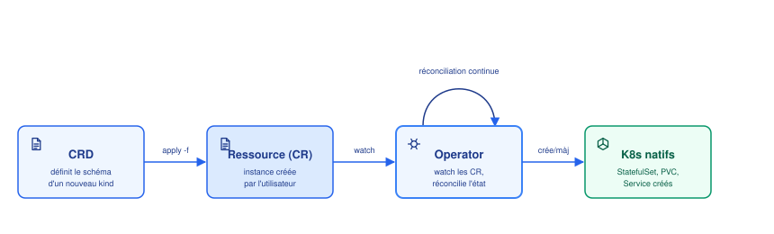

# CRD & Operators

## Contexte

L'API Kubernetes n'est pas figée aux types natifs (Pod, Deployment, Service...) — on peut lui
apprendre de nouveaux types de ressources. C'est le mécanisme d'**extensibilité** central de
Kubernetes, utilisé par la quasi-totalité de l'écosystème (cert-manager, Prometheus Operator,
Argo CD, la plupart des bases de données "cloud-native"...).

## Notes

### 📐 CustomResourceDefinition (CRD)

Une CRD enregistre un **nouveau `kind`** auprès de l'apiserver — après ça, ce type se
comporte comme n'importe quelle ressource native : validé par schéma, stocké dans etcd,
accessible via `kubectl get`.

```yaml
apiVersion: apiextensions.k8s.io/v1
kind: CustomResourceDefinition
metadata:
  name: databases.db.example.com     # <plural>.<groupe>
spec:
  group: db.example.com
  names:
    kind: Database
    plural: databases
    singular: database
  scope: Namespaced
  versions:
    - name: v1
      served: true
      storage: true
      schema:
        openAPIV3Schema:
          type: object
          properties:
            spec:
              type: object
              properties:
                engine:
                  type: string
                  enum: ["postgres", "mysql"]
                storageSize:
                  type: string
```

### 📄 Custom Resource (CR) : une instance

Une fois la CRD installée, on peut créer des objets `Database` exactement comme un
Deployment :

```yaml
apiVersion: db.example.com/v1
kind: Database
metadata:
  name: ma-base
spec:
  engine: postgres
  storageSize: 20Gi
```

```bash
kubectl apply -f ma-base.yaml
kubectl get databases
```

> [!IMPORTANT]
> Une CRD **seule** ne fait strictement rien d'utile — l'apiserver accepte et stocke l'objet
> `Database`, point. C'est la définition d'un schéma, pas d'un comportement. Sans un
> **Operator** qui la watch, `ma-base` reste juste une entrée en base, sans aucune base de
> données réellement créée.

### ⚙️ Operator : le comportement derrière le schéma



Un **Operator** est un controller custom (même principe que le controller-manager natif, voir
[architecture.md](architecture.md)) qui :
1. **watch** les objets d'un type custom (ici `Database`) via l'apiserver
2. compare l'état désiré (le `spec` de la CR) à l'état réel du cluster
3. crée/modifie les ressources **natives** nécessaires (StatefulSet pour les pods de la DB,
   PVC pour le stockage, Service pour l'exposer, Secret pour les credentials...)
4. répète en continu — la même **reconciliation loop** que tous les controllers K8s

L'Operator encode dans du code (généralement Go, via `controller-runtime` / Kubebuilder, ou
l'Operator SDK) le savoir-faire opérationnel qu'un humain ferait à la main : comment
provisionner, sauvegarder, faire un failover, upgrader une version — d'où le nom.

> [!NOTE]
> Exemples réels courants : **cert-manager** (CRD `Certificate` → génère/renouvelle des
> certificats TLS automatiquement), **Prometheus Operator** (CRD `ServiceMonitor` → configure
> le scraping Prometheus), **CloudNativePG** (CRD `Cluster` → gère un cluster PostgreSQL
> complet avec failover).

### ⚠️ Points de vigilance

> [!WARNING]
> - Les CRD sont **cluster-scoped** : installer beaucoup d'operators tiers accumule des CRD
>   globales, potentiellement en conflit de noms entre projets.
> - Une CRD sans son Operator actif (crashé, non installé) = des CR "orphelines" qui ne font
>   plus rien — toujours vérifier que le controller tourne (`kubectl get pods` dans son
>   namespace) avant de diagnostiquer côté CR.
> - Faire évoluer le schéma d'une CRD (`v1alpha1` → `v1`) de façon incompatible nécessite un
>   **conversion webhook** — pas aussi simple qu'un bump de version sur un Chart Helm.
> - Supprimer une CRD supprime **en cascade** toutes les CR de ce type dans le cluster (comme
>   supprimer un namespace, voir [namespaces.md](namespaces.md)) — et souvent les ressources
>   natives que l'Operator avait créées, selon ses `finalizers`.

## Références

- [Custom Resources (doc officielle)](https://kubernetes.io/docs/concepts/extend-kubernetes/api-extension/custom-resources/)
- [Operator pattern](https://kubernetes.io/docs/concepts/extend-kubernetes/operator/)
- [Kubebuilder Book](https://book.kubebuilder.io/)
