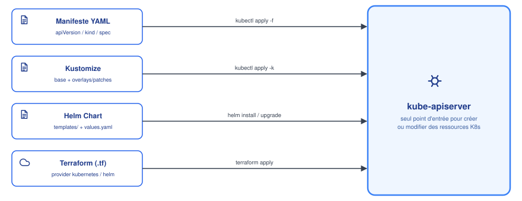

# Déployer sur Kubernetes : manifestes, Kustomize, Helm, Terraform

## Contexte

Il existe plusieurs formats/outils pour décrire et envoyer des ressources vers un cluster
Kubernetes. Tous finissent par parler au **même apiserver** — ce qui change, c'est le
format du code, la gestion des variations (dev/prod), et si un état est suivi en dehors du
cluster.

## Notes

### 🗺️ Vue d'ensemble



| Outil | Format | Templating / variantes | État suivi ? |
|---|---|---|---|
| Manifeste brut | YAML | aucun (copier-coller ou `envsubst` maison) | non (juste l'état du cluster) |
| Kustomize | YAML (base + patches) | overlays déclaratifs, pas de logique conditionnelle | non |
| Helm | YAML + templates Go | variables (`values.yaml`), conditions, boucles | oui (Release, `helm history`) |
| Terraform | HCL (`.tf`) | variables, modules, conditions | oui (state file) |

### 📄 Manifeste YAML brut

Le socle de tout : `apiVersion`, `kind`, `metadata`, `spec`. Exemple complet — un Deployment
et son Service, dans un seul fichier (le `---` sépare deux documents YAML indépendants) :

```yaml
apiVersion: apps/v1        # groupe/version de l'API qui gère ce type de ressource
kind: Deployment            # le type de ressource à créer
metadata:
  name: mon-app             # nom de l'objet dans le cluster
  labels:
    app: mon-app
spec:                        # "spec" = l'état désiré, propre à chaque kind
  replicas: 3
  selector:
    matchLabels:
      app: mon-app           # doit matcher les labels du template ci-dessous
  template:
    metadata:
      labels:
        app: mon-app
    spec:
      containers:
        - name: mon-app
          image: mon-registre/mon-app:2.4.1
          ports:
            - containerPort: 8080
          resources:
            requests:
              cpu: 100m
              memory: 128Mi
---
apiVersion: v1               # groupe "core" (pas de préfixe) : v1 tout court
kind: Service
metadata:
  name: mon-app
spec:
  selector:
    app: mon-app              # sélectionne les pods créés par le Deployment ci-dessus
  ports:
    - port: 80
      targetPort: 8080
```

```bash
kubectl apply -f deployment.yaml
```

`kubectl apply` (contrairement à `create`) fait un **merge à trois voies** (three-way merge)
entre la dernière config appliquée (annotation `kubectl.kubernetes.io/last-applied-configuration`),
l'état désiré du fichier, et l'état réel du cluster — permet des mises à jour incrémentales
sans écraser des champs gérés ailleurs (ex. par un autoscaler).

> [!IMPORTANT]
> **Ce qui se passe concrètement après `kubectl apply`** — peu importe que le YAML vienne
> d'un fichier brut, de Kustomize, de Helm ou de Terraform, la suite est identique :
> 1. `kubectl` envoie le manifeste à l'**apiserver** (REST) qui valide son schéma et passe
>    les admission controllers.
> 2. L'objet est persisté dans **etcd**, source de vérité du cluster — voir
>    [architecture.md](architecture.md).
> 3. Le **Deployment controller** (dans kube-controller-manager) voit le nouvel objet et crée
>    un **ReplicaSet** — voir [workloads-deployment.md](workloads-deployment.md).
> 4. Le **ReplicaSet controller** crée les **Pods** demandés.
> 5. Le **scheduler** assigne chaque Pod à un nœud selon les ressources disponibles — voir
>    [scheduling-avance.md](scheduling-avance.md).
> 6. Le **kubelet** du nœud choisi démarre les conteneurs via le container runtime — voir
>    [pods.md](pods.md).
>
> C'est exactement la reconciliation loop décrite dans architecture.md : à chaque étape, un
> controller différent compare l'état désiré à l'état réel et agit pour les rapprocher.

### 🧩 Kustomize

Composition de manifestes **sans templating** : une base commune + des patches par
environnement (`overlays/dev`, `overlays/prod`).

```
base/
  deployment.yaml
  kustomization.yaml
overlays/
  prod/
    kustomization.yaml   # patches : plus de réplicas, autre tag d'image...
```

**`base/kustomization.yaml`** — liste les manifestes de base, tels quels :
```yaml
resources:
  - deployment.yaml
```

**`overlays/prod/kustomization.yaml`** — repart de la base et la patche :
```yaml
resources:
  - ../../base

patches:
  - target:
      kind: Deployment
      name: mon-app
    patch: |-
      - op: replace
        path: /spec/replicas
        value: 5
      - op: replace
        path: /spec/template/spec/containers/0/image
        value: mon-registre/mon-app:2.5.0
```

```bash
kubectl apply -k overlays/prod
```

Intégré nativement à `kubectl` depuis la 1.14 — pas d'outil externe à installer. Volontairement
plus limité que Helm (pas de conditions/boucles) : la philosophie est de patcher du YAML valide,
pas de générer du YAML depuis un langage de template.

### ⚓ Helm

Voir [helm.md](helm.md) pour le détail — Chart + `values.yaml` templatés, avec suivi de
version (Release) et rollback intégré.

```bash
helm install mon-app ./chart -f values-prod.yaml
```

### ☁️ Terraform

Décrit l'infrastructure en **HCL** (`.tf`), pas limité à Kubernetes — peut gérer dans le même
projet le cluster AKS lui-même **et** les ressources qui tournent dedans, via deux providers :

- **provider `kubernetes`** : ressources K8s natives (`kubernetes_deployment`,
  `kubernetes_config_map`...), un bloc HCL par objet.
- **provider `helm`** : pilote l'installation de Charts Helm depuis Terraform
  (`helm_release`), combine les deux mondes.

```hcl
resource "helm_release" "mon_app" {
  name       = "mon-app"
  chart      = "./chart"
  namespace  = "prod"
  values     = [file("values-prod.yaml")]
}
```

```bash
terraform plan   # preview des changements
terraform apply  # applique, met à jour le state
```

Terraform garde un **state file** qui reflète ce qu'il croit avoir créé — c'est sa source de
vérité, distincte de l'état réel du cluster.

### ⚠️ Points de vigilance

> [!WARNING]
> - Ne jamais gérer les **mêmes ressources** avec deux outils différents (ex. Terraform +
>   `kubectl apply` manuel sur le même Deployment) — chacun écrase les changements de l'autre
>   à son prochain passage.
> - **Drift Terraform** : si quelqu'un modifie une ressource directement (`kubectl edit`) sans
>   passer par Terraform, le state diverge du cluster réel — `terraform plan` le détecte mais
>   ne corrige rien tant que `apply` n'est pas relancé.
> - Kustomize n'a pas de notion de version/rollback intégrée comme Helm — c'est juste du YAML
>   patché, l'historique dépend entièrement de Git.
> - Combiner Helm + Kustomize (post-render) est possible mais ajoute une couche de complexité
>   à documenter clairement si utilisé.

## Références

- [kubectl apply](https://kubernetes.io/docs/tasks/manage-kubernetes-objects/declarative-config/)
- [Kustomize (documentation officielle)](https://kubectl.docs.kubernetes.io/references/kustomize/)
- [Terraform provider kubernetes](https://registry.terraform.io/providers/hashicorp/kubernetes/latest/docs)
- [Terraform provider helm](https://registry.terraform.io/providers/hashicorp/helm/latest/docs)
