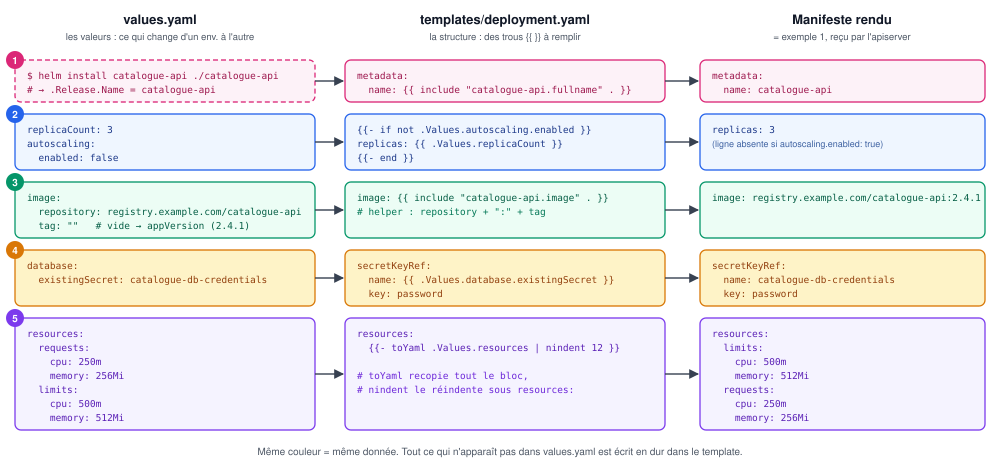

# Exemple 2 — Le même Deployment en chart Helm

## Contexte

Deuxième exemple du [fil rouge](README.md). On reprend **exactement** le Deployment de
[l'exemple 1](01-deployment-annote.md) et on le transforme en chart Helm : ce qui varie d'un
environnement à l'autre part dans `values.yaml`, la structure reste dans le template. Le
but est de voir, champ par champ, d'où vient chaque ligne du manifeste final.

Les bases de Helm (Chart, Release, syntaxe des templates) sont dans [helm.md](../helm.md).

## Notes

### 🗺️ La correspondance en un coup d'œil



| # | `values.yaml` | Expression dans le template | Résultat dans le manifeste |
|---|---|---|---|
| 1 | *(aucune : nom de Release)* | `{{ include "catalogue-api.fullname" . }}` | `name: catalogue-api` |
| 2 | `replicaCount: 3`, `autoscaling.enabled: false` | `{{- if not .Values.autoscaling.enabled }}` … `{{ .Values.replicaCount }}` | `replicas: 3` |
| 3 | `image.repository`, `image.tag: ""` | `{{ include "catalogue-api.image" . }}` | `image: registry.example.com/catalogue-api:2.4.1` |
| 4 | `database.existingSecret` | `{{ .Values.database.existingSecret }}` | `name: catalogue-db-credentials` |
| 5 | bloc `resources` | `{{- toYaml .Values.resources \| nindent 12 }}` | bloc `resources` recopié |

> [!NOTE]
> **Règle de découpage** : va dans `values.yaml` ce qui **change entre environnements**
> (nombre de réplicas, image, ressources, configuration). Reste en dur dans le template ce
> qui dépend du **code de l'application** et ne varie pas (chemins des probes, port nommé
> `http`, volume `/tmp`). Un `values.yaml` qui expose chaque champ devient un second
> manifeste, en plus illisible.

### 📁 Arborescence du chart

```
catalogue-api/
├── Chart.yaml
├── values.yaml
└── templates/
    ├── _helpers.tpl          # noms et labels réutilisés partout
    ├── deployment.yaml       # le Deployment de l'exemple 1
    ├── configmap.yaml        # catalogue-api-config
    ├── service.yaml          # Service catalogue-api
    └── serviceaccount.yaml   # ServiceAccount catalogue-api
```

Le Secret `catalogue-db-credentials` n'est **pas** dans le chart : il est créé à part, comme
dans l'exemple 1, et le chart se contente de connaître son nom.

### 🏷️ Chart.yaml

```yaml
apiVersion: v2              # format de chart Helm 3
name: catalogue-api         # nom du chart → .Chart.Name
description: API catalogue de la boutique
type: application
version: 1.0.0              # version du CHART (change quand les templates changent)
appVersion: "2.4.1"         # version de l'APPLICATION → tag d'image par défaut
```

### 🎛️ values.yaml

```yaml
# Nom des ressources ; vide → nom de la Release (voir _helpers.tpl)
fullnameOverride: ""

# ② Nombre de Pods — ignoré si autoscaling.enabled est vrai
replicaCount: 3
autoscaling:
  enabled: false            # true → le template n'écrit pas replicas (un HPA le gère)

# ③ Image : tag vide → appVersion de Chart.yaml
image:
  repository: registry.example.com/catalogue-api
  tag: ""
  pullPolicy: IfNotPresent

revisionHistoryLimit: 5
minReadySeconds: 10
rollingUpdate:
  maxSurge: 1
  maxUnavailable: 0

containerPort: 8080

service:
  type: ClusterIP
  port: 80

# Contenu du ConfigMap, injecté en variables d'environnement via envFrom
config:
  DB_HOST: postgres
  DB_PORT: "5432"
  DB_NAME: catalogue
  LOG_LEVEL: info

# ④ Secret des identifiants PostgreSQL, créé HORS du chart
database:
  existingSecret: catalogue-db-credentials

# ⑤ Recopié tel quel dans le conteneur
resources:
  requests:
    cpu: 250m
    memory: 256Mi
  limits:
    cpu: 500m
    memory: 512Mi

podSecurityContext:
  runAsNonRoot: true
  runAsUser: 10001
  runAsGroup: 10001
  seccompProfile:
    type: RuntimeDefault

containerSecurityContext:
  allowPrivilegeEscalation: false
  readOnlyRootFilesystem: true
  capabilities:
    drop: ["ALL"]
```

> [!CAUTION]
> Ne jamais mettre le mot de passe dans `values.yaml` ni dans un `--set` : le fichier finit
> dans Git, et Helm conserve chaque révision de la Release (manifestes rendus **et** valeurs)
> dans un Secret `sh.helm.release.v1.<release>.v<N>` du namespace, lisible par quiconque a le
> droit de lire les Secrets. Le chart référence un Secret existant par son nom, c'est tout.

### 🧰 templates/_helpers.tpl

```yaml
{{/* ① Nom des ressources : fullnameOverride, sinon le nom de la Release */}}
{{- define "catalogue-api.fullname" -}}
{{- default .Release.Name .Values.fullnameOverride | trunc 63 | trimSuffix "-" }}
{{- end }}

{{/* ③ Tag effectif : image.tag, sinon appVersion */}}
{{- define "catalogue-api.imageTag" -}}
{{- .Values.image.tag | default .Chart.AppVersion }}
{{- end }}

{{/* ③ Référence d'image complète : repository:tag */}}
{{- define "catalogue-api.image" -}}
{{ .Values.image.repository }}:{{ include "catalogue-api.imageTag" . }}
{{- end }}

{{/* Labels du selector : stables, jamais modifiés après la première installation */}}
{{- define "catalogue-api.selectorLabels" -}}
app.kubernetes.io/name: {{ .Chart.Name }}
app.kubernetes.io/instance: {{ .Release.Name }}
app.kubernetes.io/component: api
{{- end }}

{{/* Labels complets, posés sur les objets (pas sur les Pods) */}}
{{- define "catalogue-api.labels" -}}
{{ include "catalogue-api.selectorLabels" . }}
app.kubernetes.io/part-of: boutique
app.kubernetes.io/version: {{ include "catalogue-api.imageTag" . | quote }}
app.kubernetes.io/managed-by: {{ .Release.Service }}
helm.sh/chart: {{ .Chart.Name }}-{{ .Chart.Version }}
{{- end }}
```

- `trunc 63` : un nom d'objet utilisé comme label ou nom DNS est limité à 63 caractères.
- `app.kubernetes.io/instance` = nom de la Release : permet d'installer le chart deux fois
  dans le même namespace (`catalogue-api` et `catalogue-api-canary`) sans que les selectors
  des deux Deployments se chevauchent.
- `helm.sh/chart` n'est volontairement **pas** posé sur les Pods : il contient la version du
  chart, et le mettre dans le `template` du Pod déclencherait un rollout à chaque montée de
  version du chart, même sans aucun changement de l'application.

### 🧱 templates/deployment.yaml

```yaml
apiVersion: apps/v1
kind: Deployment
metadata:
  name: {{ include "catalogue-api.fullname" . }}
  namespace: {{ .Release.Namespace }}
  labels:
    {{- include "catalogue-api.labels" . | nindent 4 }}
spec:
  {{- if not .Values.autoscaling.enabled }}
  replicas: {{ .Values.replicaCount }}
  {{- end }}
  revisionHistoryLimit: {{ .Values.revisionHistoryLimit }}
  minReadySeconds: {{ .Values.minReadySeconds }}
  progressDeadlineSeconds: 600
  selector:
    matchLabels:
      {{- include "catalogue-api.selectorLabels" . | nindent 6 }}
  strategy:
    type: RollingUpdate
    rollingUpdate:
      {{- toYaml .Values.rollingUpdate | nindent 6 }}
  template:
    metadata:
      labels:
        {{- include "catalogue-api.selectorLabels" . | nindent 8 }}
        app.kubernetes.io/part-of: boutique
        app.kubernetes.io/version: {{ include "catalogue-api.imageTag" . | quote }}
      annotations:
        checksum/config: {{ include (print $.Template.BasePath "/configmap.yaml") . | sha256sum }}
    spec:
      serviceAccountName: {{ include "catalogue-api.fullname" . }}
      automountServiceAccountToken: false
      terminationGracePeriodSeconds: 30
      securityContext:
        {{- toYaml .Values.podSecurityContext | nindent 8 }}
      topologySpreadConstraints:
        - maxSkew: 1
          topologyKey: kubernetes.io/hostname
          whenUnsatisfiable: ScheduleAnyway
          labelSelector:
            matchLabels:
              {{- include "catalogue-api.selectorLabels" . | nindent 14 }}
      containers:
        - name: api
          image: {{ include "catalogue-api.image" . }}
          imagePullPolicy: {{ .Values.image.pullPolicy }}
          ports:
            - name: http
              containerPort: {{ .Values.containerPort }}
              protocol: TCP
          envFrom:
            - configMapRef:
                name: {{ include "catalogue-api.fullname" . }}-config
          env:
            - name: DB_USER
              valueFrom:
                secretKeyRef:
                  name: {{ .Values.database.existingSecret }}
                  key: username
            - name: DB_PASSWORD
              valueFrom:
                secretKeyRef:
                  name: {{ .Values.database.existingSecret }}
                  key: password
          resources:
            {{- toYaml .Values.resources | nindent 12 }}
          startupProbe:
            httpGet:
              path: /healthz
              port: http
            periodSeconds: 5
            failureThreshold: 24
          readinessProbe:
            httpGet:
              path: /ready
              port: http
            periodSeconds: 10
            failureThreshold: 3
          livenessProbe:
            httpGet:
              path: /healthz
              port: http
            periodSeconds: 20
            failureThreshold: 3
          securityContext:
            {{- toYaml .Values.containerSecurityContext | nindent 12 }}
          volumeMounts:
            - name: tmp
              mountPath: /tmp
      volumes:
        - name: tmp
          emptyDir: {}
```

Les trois points qui n'existaient pas dans l'exemple 1 :

| Élément | Rôle |
|---|---|
| `{{- if not .Values.autoscaling.enabled }}` | n'écrit `replicas` que si aucun HPA ne gère le Deployment — règle le piège décrit dans l'exemple 1 |
| `nindent N` | le bloc inséré doit tomber à la bonne colonne : 4 sous `metadata.labels`, 6 sous `matchLabels`, 8 sous `template.metadata.labels`, 12 sous `resources` du conteneur |
| `checksum/config` | hash du ConfigMap rendu, posé sur le **Pod** : si `config` change, le hash change, donc le `template` change, donc rollout. Sans lui, les Pods garderaient les anciennes variables (lues au démarrage) |

### 🔗 Les autres templates

**`templates/configmap.yaml`**
```yaml
apiVersion: v1
kind: ConfigMap
metadata:
  name: {{ include "catalogue-api.fullname" . }}-config
  namespace: {{ .Release.Namespace }}
  labels:
    {{- include "catalogue-api.labels" . | nindent 4 }}
data:
  {{- range $key, $value := .Values.config }}
  {{ $key }}: {{ $value | quote }}
  {{- end }}
```

`range` parcourt la map `config` (dans l'ordre alphabétique des clés) ; `quote` garantit des
chaînes, donc plus de piège du `5432` sans guillemets.

**`templates/service.yaml`**
```yaml
apiVersion: v1
kind: Service
metadata:
  name: {{ include "catalogue-api.fullname" . }}
  namespace: {{ .Release.Namespace }}
  labels:
    {{- include "catalogue-api.labels" . | nindent 4 }}
spec:
  type: {{ .Values.service.type }}
  selector:
    {{- include "catalogue-api.selectorLabels" . | nindent 4 }}
  ports:
    - name: http
      port: {{ .Values.service.port }}
      targetPort: http
```

**`templates/serviceaccount.yaml`**
```yaml
apiVersion: v1
kind: ServiceAccount
metadata:
  name: {{ include "catalogue-api.fullname" . }}
  namespace: {{ .Release.Namespace }}
  labels:
    {{- include "catalogue-api.labels" . | nindent 4 }}
automountServiceAccountToken: false
```

### 🖨️ Le rendu : ce que reçoit l'apiserver

```bash
helm template catalogue-api ./catalogue-api -n boutique --show-only templates/deployment.yaml
```

```yaml
---
# Source: catalogue-api/templates/deployment.yaml
apiVersion: apps/v1
kind: Deployment
metadata:
  name: catalogue-api
  namespace: boutique
  labels:
    app.kubernetes.io/name: catalogue-api
    app.kubernetes.io/instance: catalogue-api
    app.kubernetes.io/component: api
    app.kubernetes.io/part-of: boutique
    app.kubernetes.io/version: "2.4.1"
    app.kubernetes.io/managed-by: Helm
    helm.sh/chart: catalogue-api-1.0.0
spec:
  replicas: 3
  revisionHistoryLimit: 5
  minReadySeconds: 10
  progressDeadlineSeconds: 600
  selector:
    matchLabels:
      app.kubernetes.io/name: catalogue-api
      app.kubernetes.io/instance: catalogue-api
      app.kubernetes.io/component: api
  strategy:
    type: RollingUpdate
    rollingUpdate:
      maxSurge: 1
      maxUnavailable: 0
  template:
    metadata:
      labels:
        app.kubernetes.io/name: catalogue-api
        app.kubernetes.io/instance: catalogue-api
        app.kubernetes.io/component: api
        app.kubernetes.io/part-of: boutique
        app.kubernetes.io/version: "2.4.1"
      annotations:
        checksum/config: 19c98657f3...   # abrégé ici : SHA-256 complet de 64 caractères hexadécimaux
    spec:
      serviceAccountName: catalogue-api
      automountServiceAccountToken: false
      terminationGracePeriodSeconds: 30
      securityContext:
        runAsGroup: 10001
        runAsNonRoot: true
        runAsUser: 10001
        seccompProfile:
          type: RuntimeDefault
      topologySpreadConstraints:
        - maxSkew: 1
          topologyKey: kubernetes.io/hostname
          whenUnsatisfiable: ScheduleAnyway
          labelSelector:
            matchLabels:
              app.kubernetes.io/name: catalogue-api
              app.kubernetes.io/instance: catalogue-api
              app.kubernetes.io/component: api
      containers:
        - name: api
          image: registry.example.com/catalogue-api:2.4.1
          imagePullPolicy: IfNotPresent
          ports:
            - name: http
              containerPort: 8080
              protocol: TCP
          envFrom:
            - configMapRef:
                name: catalogue-api-config
          env:
            - name: DB_USER
              valueFrom:
                secretKeyRef:
                  name: catalogue-db-credentials
                  key: username
            - name: DB_PASSWORD
              valueFrom:
                secretKeyRef:
                  name: catalogue-db-credentials
                  key: password
          resources:
            limits:
              cpu: 500m
              memory: 512Mi
            requests:
              cpu: 250m
              memory: 256Mi
          startupProbe:
            httpGet:
              path: /healthz
              port: http
            periodSeconds: 5
            failureThreshold: 24
          readinessProbe:
            httpGet:
              path: /ready
              port: http
            periodSeconds: 10
            failureThreshold: 3
          livenessProbe:
            httpGet:
              path: /healthz
              port: http
            periodSeconds: 20
            failureThreshold: 3
          securityContext:
            allowPrivilegeEscalation: false
            capabilities:
              drop:
              - ALL
            readOnlyRootFilesystem: true
          volumeMounts:
            - name: tmp
              mountPath: /tmp
      volumes:
        - name: tmp
          emptyDir: {}
```

**Différences avec l'exemple 1**, et seulement celles-ci :

| Différence | Origine |
|---|---|
| labels `instance`, `managed-by: Helm`, `helm.sh/chart` en plus | conventions Helm (`_helpers.tpl`) |
| `app.kubernetes.io/instance` aussi dans le `selector` | permet plusieurs Releases du chart dans un namespace |
| annotation `checksum/config` sur les Pods | redéploiement automatique quand la config change |
| plus d'annotation `kubernetes.io/change-cause` | l'historique est tenu par Helm : `helm history catalogue-api -n boutique` |
| clés des blocs `toYaml` triées alphabétiquement (`limits` avant `requests`) | comportement de `toYaml`, sans effet sur Kubernetes |

Une fois installées, les ressources portent en plus les annotations
`meta.helm.sh/release-name` et `meta.helm.sh/release-namespace`, ajoutées par Helm au moment
de l'envoi (elles n'apparaissent pas dans `helm template`). C'est grâce à elles que Helm
sait quels objets appartiennent à quelle Release.

### 🔧 Installer, puis décliner par environnement

```bash
helm lint ./catalogue-api
helm upgrade --install catalogue-api ./catalogue-api -n boutique
```

`upgrade --install` installe si la Release n'existe pas, met à jour sinon : une seule
commande pour la CI. Pour la production, un fichier de surcharge ne contient **que** ce qui
diffère :

**`values-prod.yaml`**
```yaml
replicaCount: 6
image:
  tag: "2.5.0"
resources:
  requests:
    cpu: 500m
    memory: 512Mi
  limits:
    cpu: "1"
    memory: 1Gi
config:
  LOG_LEVEL: warn
```

```bash
helm upgrade --install catalogue-api ./catalogue-api -n boutique -f values-prod.yaml
```

Les maps sont **fusionnées** en profondeur avec `values.yaml` : `config` garde `DB_HOST`,
`DB_PORT` et `DB_NAME`, seul `LOG_LEVEL` change. Ce changement modifie le ConfigMap, donc
`checksum/config`, donc déclenche un rollout. Les **listes**, elles, sont remplacées en
entier, jamais fusionnées.

> [!WARNING]
> - **`helm upgrade` repart des valeurs du chart** : sans `-f`/`--set`, les surcharges
>   passées à l'installation précédente sont perdues (sauf `--reuse-values`, qui a ses
>   propres pièges). Toujours repasser les mêmes fichiers `-f`, idéalement depuis la CI.
> - **Passer de l'exemple 1 à l'exemple 2 sur un cluster existant** : `helm install` refuse
>   un Deployment déjà créé par `kubectl apply` (il n'a pas les annotations
>   `meta.helm.sh/*`). Et même en les ajoutant, le `selector` du chart contient
>   `app.kubernetes.io/instance`, absent de l'original : le champ étant immuable, la mise à
>   jour est rejetée. Il faut soit garder exactement le même selector, soit supprimer
>   l'ancien Deployment avant l'installation (coupure à prévoir).

## Références

- [Chart Template Guide](https://helm.sh/docs/chart_template_guide/getting_started/)
- [Helm : Tips and Tricks (checksum, include, required)](https://helm.sh/docs/howto/charts_tips_and_tricks/)
- [Helm : Labels and Annotations](https://helm.sh/docs/chart_best_practices/labels/)
- [Helm : Values Files (fusion des valeurs)](https://helm.sh/docs/chart_template_guide/values_files/)
