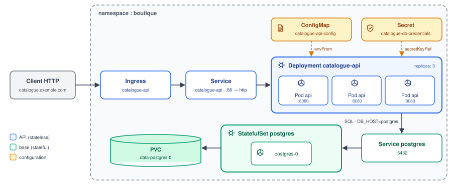

# Exemples concrets — fil rouge catalogue-api

Exemples complets et commentés, construits autour d'**un seul cas d'usage** pour que chaque
page reprenne exactement les mêmes objets que la précédente.

## Le cas d'usage

Une boutique en ligne expose une **API web `catalogue-api`** (stateless, 3 réplicas) qui lit
et écrit dans **sa base PostgreSQL** (stateful, un Pod `postgres-0` avec son volume
persistant). Tout vit dans le namespace `boutique`.

| Objet | Nom | Rôle |
|---|---|---|
| Deployment | `catalogue-api` | fait tourner les 3 Pods de l'API |
| Service | `catalogue-api` | adresse stable de l'API (port 80 → port nommé `http` des Pods) |
| Ingress | `catalogue-api` | expose l'API sur `catalogue.example.com` |
| ConfigMap | `catalogue-api-config` | configuration non sensible (`DB_HOST`, `DB_PORT`, `DB_NAME`, `LOG_LEVEL`) |
| Secret | `catalogue-db-credentials` | identifiants PostgreSQL (`username`, `password`) |
| ServiceAccount | `catalogue-api` | identité des Pods de l'API |
| StatefulSet | `postgres` | la base, avec identité et stockage stables |
| Service | `postgres` | adresse de la base, utilisée par l'API via `DB_HOST=postgres` |
| PVC | `data-postgres-0` | volume de données de `postgres-0` |

## Progression

1. [01-deployment-annote.md](01-deployment-annote.md) — le Deployment de l'API en YAML brut,
   chaque champ annoté, plus les objets qu'il référence
2. [02-deployment-helm.md](02-deployment-helm.md) — **le même** Deployment sous forme de
   chart Helm : `values.yaml`, template, rendu, et la correspondance champ par champ
3. [03-apiversion-par-kind.md](03-apiversion-par-kind.md) — quelle `apiVersion` écrire pour
   chaque `kind`, avec l'objet correspondant du fil rouge

Les notes théoriques associées sont dans le [sommaire Kubernetes](../README.md).
