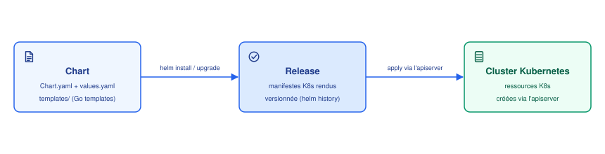

# Helm

## Contexte

Gérer des applications complexes avec des manifestes YAML bruts devient vite ingérable :
répétition entre environnements, pas de notion de version d'un déploiement complet, pas de
variables. Helm est le gestionnaire de paquets de facto pour Kubernetes — l'équivalent
d'`apt`/`yum` mais pour des applications K8s.

## Notes

### 📦 Chart : le paquet

Un **Chart** est un paquet Helm : un dossier avec une structure standard.

```
mon-app/
├── Chart.yaml            # métadonnées : nom, version du chart, appVersion
├── values.yaml           # valeurs par défaut, injectées dans les templates
├── values.schema.json    # (optionnel) schéma JSON qui valide values.yaml
├── .helmignore           # fichiers exclus du packaging (comme .gitignore)
├── templates/            # manifestes K8s sous forme de templates Go
│   ├── deployment.yaml
│   ├── service.yaml
│   ├── ingress.yaml
│   ├── _helpers.tpl      # templates nommés réutilisables (jamais rendu seul)
│   └── NOTES.txt         # message affiché après install/upgrade, templaté aussi
├── crds/                 # CustomResourceDefinitions, installées à part, jamais templatées
└── charts/               # sous-charts (dépendances embarquées)
```

| Fichier | Rôle |
|---|---|
| `Chart.yaml` | identité du chart : nom, version du **chart**, `appVersion` (version de l'appli packagée — les deux évoluent indépendamment) |
| `values.yaml` | valeurs par défaut consommées par les templates |
| `templates/*.yaml` | un manifeste K8s par fichier, avec des `{{ }}` dedans |
| `templates/_*.tpl` | le préfixe `_` dit à Helm "ne rends jamais ce fichier tout seul" — sert uniquement à définir des blocs réutilisables |
| `templates/NOTES.txt` | pas un manifeste — du texte templaté affiché en console après `install`/`upgrade` |
| `.helmignore` | exclut des fichiers du `.tgz` généré par `helm package` (ex. fichiers de dev, `.git`) |
| `crds/` | Custom Resource Definitions à installer avant tout le reste — volontairement **pas** templatées (trop risqué de templater une définition de schéma) |

Les templates utilisent la syntaxe **Go templates** (+ fonctions Sprig) :

```yaml
replicas: {{ .Values.replicaCount }}
image: "{{ .Values.image.repository }}:{{ .Values.image.tag }}"
```

### 🔁 Chart → Release → Cluster



- `helm install <name> <chart>` : fusionne `values.yaml` (+ overrides) dans les templates,
  produit des manifestes K8s, les envoie à l'apiserver. Cette instance déployée s'appelle une
  **Release**.
- `helm upgrade <name> <chart>` : nouvelle révision de la Release, garde l'historique
  (`helm history <name>`).
- `helm rollback <name> <revision>` : revient à une révision précédente.
- `helm uninstall <name>` : supprime les ressources créées par la Release — **avec deux
  exceptions** :
  - les CRD installées depuis le dossier `crds/` restent en place (les supprimer effacerait
    en cascade toutes les ressources custom du cluster, Helm refuse de le faire pour vous) ;
  - les ressources annotées `helm.sh/resource-policy: keep` sont conservées (typiquement un
    PVC ou un Secret qu'on ne veut pas perdre à la désinstallation) — elles deviennent
    orphelines, plus gérées par aucune Release.

> [!NOTE]
> Une même Release est **scoped à un namespace** — le même Chart peut être installé
> plusieurs fois sous des noms de Release différents (multi-tenant, multi-environnement).

### 🧪 Exemple concret complet

Un chart minimal mais réaliste, fichier par fichier.

**`Chart.yaml`**
```yaml
apiVersion: v2
name: mon-app
description: Une application web simple
type: application
version: 1.2.0        # version du Chart lui-même (change à chaque modif des templates)
appVersion: "2.4.1"    # version de l'application packagée (l'image Docker)
```

**`values.yaml`**
```yaml
replicaCount: 2

image:
  repository: mon-registre/mon-app
  tag: "2.4.1"
  pullPolicy: IfNotPresent

service:
  type: ClusterIP
  port: 80

resources:
  requests:
    cpu: 100m
    memory: 128Mi
  limits:
    cpu: 500m
    memory: 256Mi

ingress:
  enabled: false
```

**`templates/_helpers.tpl`** — définit un nom réutilisable partout ailleurs :
```yaml
{{- define "mon-app.fullname" -}}
{{ .Release.Name }}-{{ .Chart.Name }}
{{- end -}}
```

**`templates/deployment.yaml`**
```yaml
apiVersion: apps/v1
kind: Deployment
metadata:
  name: {{ include "mon-app.fullname" . }}
  labels:
    app: {{ .Chart.Name }}
spec:
  replicas: {{ .Values.replicaCount }}
  selector:
    matchLabels:
      app: {{ .Chart.Name }}
  template:
    metadata:
      labels:
        app: {{ .Chart.Name }}
    spec:
      containers:
        - name: {{ .Chart.Name }}
          image: "{{ .Values.image.repository }}:{{ .Values.image.tag }}"
          imagePullPolicy: {{ .Values.image.pullPolicy }}
          ports:
            - containerPort: 8080
          resources:
            {{- toYaml .Values.resources | nindent 12 }}
```

**`templates/ingress.yaml`** — entièrement conditionnel :
```yaml
{{- if .Values.ingress.enabled }}
apiVersion: networking.k8s.io/v1
kind: Ingress
metadata:
  name: {{ include "mon-app.fullname" . }}
spec:
  rules:
    - host: {{ .Values.ingress.host }}
{{- end }}
```

### 🔤 Comprendre la syntaxe des templates

Les bouts un peu "bizarres" dans du YAML par ailleurs normal :

| Syntaxe | Ce que ça fait |
|---|---|
| `{{ .Values.x }}` | insère une valeur venant de `values.yaml` |
| `{{ .Release.Name }}` / `{{ .Chart.Name }}` | objets intégrés : nom de la Release, nom du chart |
| `{{- ... }}` / `{{ ... -}}` | le `-` supprime les espaces/retours à la ligne juste avant/après — évite des lignes vides parasites dans le YAML final |
| `{{ if .Values.x }}...{{ end }}` | inclut le bloc seulement si `.Values.x` est vrai/non-vide |
| `{{ range .Values.list }}...{{ end }}` | boucle sur une liste ou une map |
| `{{ include "mon-app.fullname" . }}` | appelle le template nommé défini dans `_helpers.tpl` ; le `.` final passe le contexte courant (sinon le template appelé ne voit ni `.Values` ni `.Release`) |
| `{{ .Values.x \| default "y" }}` | valeur de repli si `.Values.x` est vide |
| `{{ toYaml .Values.resources \| nindent 12 }}` | convertit une structure (map/liste) en YAML puis la réindente de 12 espaces — pattern très courant pour injecter tout un bloc (`resources`, `env`, `volumes`) sans le retaper champ par champ |

### 🖨️ Ce qui est réellement envoyé à Kubernetes

`helm template`/`helm install` résolvent tous les `{{ }}` et envoient du **YAML Kubernetes
tout ce qu'il y a de plus normal** — Kubernetes ne sait même pas que Helm existe. Avec
`helm install mon-release ./mon-app` et les valeurs par défaut (`replicaCount: 2`), le
`deployment.yaml` ci-dessus devient :

```yaml
apiVersion: apps/v1
kind: Deployment
metadata:
  name: mon-release-mon-app
  labels:
    app: mon-app
spec:
  replicas: 2
  selector:
    matchLabels:
      app: mon-app
  template:
    metadata:
      labels:
        app: mon-app
    spec:
      containers:
        - name: mon-app
          image: "mon-registre/mon-app:2.4.1"
          imagePullPolicy: IfNotPresent
          ports:
            - containerPort: 8080
          resources:
            requests:
              cpu: 100m
              memory: 128Mi
            limits:
              cpu: 500m
              memory: 256Mi
```

C'est **ce fichier-là** que l'apiserver reçoit et valide — voir
[deploiement-iac.md](deploiement-iac.md) pour la suite : ce que fait Kubernetes une fois
qu'il a ce manifeste (création du ReplicaSet, des Pods, scheduling...).

### 🔧 Personnaliser les valeurs

```bash
helm install mon-app ./mon-app -f values-prod.yaml --set replicaCount=5
```

Ordre de priorité (le dernier gagne) : `values.yaml` du chart → fichiers `-f` (dans l'ordre
donné) → `--set` en ligne de commande.

### 📚 Dépôts (repos)

Un Chart peut être publié dans un **repo Helm** (registre HTTP ou OCI) :

```bash
helm repo add bitnami https://charts.bitnami.com/bitnami
helm repo update
helm install my-redis bitnami/redis
```

### ✅ Bonnes pratiques

> [!TIP]
> - `helm lint ./mon-app` : valide la structure et la syntaxe du chart avant déploiement.
> - `helm template ./mon-app` : rend les manifestes localement sans rien envoyer au cluster —
>   indispensable pour relire ce qui sera réellement appliqué.
> - `helm diff upgrade` (plugin) : preview des changements avant un `upgrade` réel.
> - `--atomic` sur `install`/`upgrade` : rollback automatique si le déploiement échoue.
> - Séparer les valeurs par environnement (`values-dev.yaml`, `values-prod.yaml`) plutôt que
>   dupliquer des charts entiers.

Pour comparer Helm aux autres façons de déployer sur Kubernetes (manifeste brut, Kustomize,
Terraform), voir [deploiement-iac.md](deploiement-iac.md).

## Références

- [Helm (documentation officielle)](https://helm.sh/docs/)
- [Chart Template Guide](https://helm.sh/docs/chart_template_guide/getting_started/)
