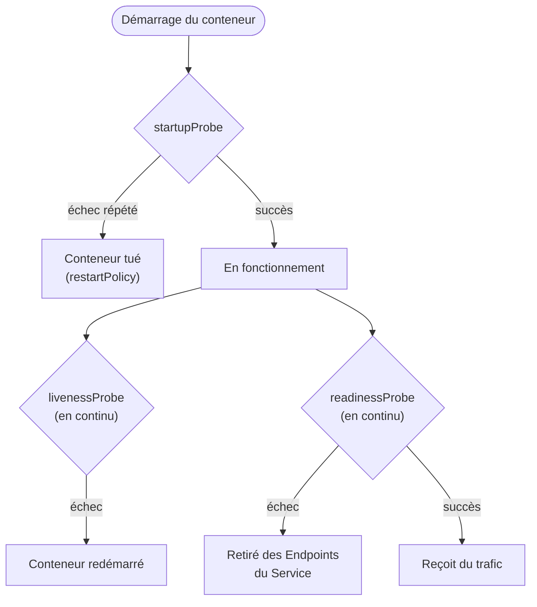

# Observabilité : probes et logs

## Contexte

Kubernetes ne sait pas "deviner" si une application est en bonne santé — il faut le lui dire
explicitement via des probes. Mal configurées, elles causent plus d'incidents qu'elles n'en
évitent (redémarrages en boucle, trafic coupé inutilement).

## Notes

### Les trois probes

- **startupProbe** : vérifie que l'appli a fini de démarrer avant que liveness/readiness ne
  prennent le relais. Essentiel pour les applis à démarrage lent (JVM, gros cache à charger)
  — évite qu'un liveness trop impatient tue le pod pendant qu'il démarre encore.
- **livenessProbe** : "l'appli est-elle vivante ?" Un échec entraîne un **redémarrage** du
  conteneur. À utiliser uniquement pour détecter un état bloqué irrécupérable (deadlock),
  pas pour des dépendances externes temporairement indisponibles (sinon boucle de redémarrage
  inutile — le problème n'est pas dans le conteneur).
- **readinessProbe** : "l'appli peut-elle recevoir du trafic maintenant ?" Un échec retire le
  pod des `Endpoints` du Service (pas de redémarrage). À utiliser pour les dépendances
  externes (DB, cache) et la charge temporaire.

### Types de vérification

- `httpGet` : requête HTTP, succès si code 200-399
- `tcpSocket` : simple ouverture de connexion TCP
- `exec` : exécution d'une commande dans le conteneur, succès si exit code 0
- `grpc` : health check natif gRPC (protocole standard `grpc.health.v1`)

Paramètres communs : `initialDelaySeconds`, `periodSeconds`, `timeoutSeconds`,
`failureThreshold`, `successThreshold`.

### Logs

- Les logs d'un conteneur = ce qui est écrit sur **stdout/stderr**, récupérés via
  `kubectl logs` (lit les fichiers gérés par le container runtime sur le nœud).
- Kubernetes ne fait **aucune agrégation** de logs nativement au-delà d'un seul pod/nœud —
  en production, on déploie un agent de collecte (Fluentd/Fluent Bit/Vector, souvent en
  DaemonSet) qui envoie vers un backend centralisé (Loki, Elasticsearch, Azure Monitor).
- Pas de rotation gérée par Kubernetes lui-même par défaut sur les logs de conteneur
  (dépend du container runtime, ex. containerd fait de la rotation basique) — la collecte
  externe reste indispensable pour la rétention long terme.
- `kubectl logs --previous` : logs du conteneur précédent, indispensable pour diagnostiquer
  un crash (CrashLoopBackOff).

### Points de vigilance

- Une `livenessProbe` qui dépend d'une ressource externe (DB down) peut provoquer un
  redémarrage en cascade de tous les pods sans résoudre le problème réel.
- `initialDelaySeconds` trop court sur liveness = redémarrages intempestifs au démarrage
  → préférer un `startupProbe` dédié plutôt que d'allonger le délai de liveness.
- Sans `readinessProbe`, un pod est considéré Ready dès sa création → peut recevoir du
  trafic avant d'être réellement prêt.

## Références

- [Configure Liveness, Readiness and Startup Probes](https://kubernetes.io/docs/tasks/configure-pod-container/configure-liveness-readiness-startup-probes/)
- [Logging Architecture](https://kubernetes.io/docs/concepts/cluster-administration/logging/)
