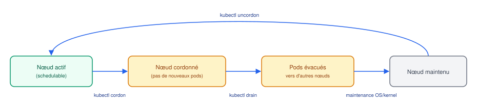

# Opérations et troubleshooting

## Contexte

Aide-mémoire opérationnel : gestes courants de maintenance et démarche de diagnostic quand
quelque chose ne va pas.

## Notes

### Maintenance de nœuds



- `kubectl cordon <node>` : marque le nœud `Unschedulable` — aucun **nouveau** pod n'y sera
  placé, mais les pods existants continuent de tourner.
- `kubectl drain <node>` : évince proprement les pods du nœud (respecte les
  PodDisruptionBudget), les recrée ailleurs via leurs controllers. Implique un cordon
  automatique. Options utiles : `--ignore-daemonsets` (les DaemonSets ne sont pas évacuables),
  `--delete-emptydir-data`.
- `kubectl uncordon <node>` : réautorise le scheduling sur le nœud.

**PodDisruptionBudget (PDB)** : définit combien de pods d'une appli peuvent être
indisponibles simultanément pendant une éviction volontaire (drain, upscale du cluster).
Protège la disponibilité pendant les opérations de maintenance planifiées (n'a aucun effet
sur les pannes non planifiées).

### Rollout et rollback

```bash
kubectl rollout status deployment/<name>       # suivre un déploiement en cours
kubectl rollout history deployment/<name>      # voir les révisions
kubectl rollout undo deployment/<name>         # revenir à la révision précédente
kubectl rollout undo deployment/<name> --to-revision=N
kubectl rollout restart deployment/<name>      # forcer un redémarrage des pods (ex. après MAJ d'un Secret)
```

### Démarche de troubleshooting d'un pod

1. `kubectl get pods -n <ns>` : quel est l'état (Pending, CrashLoopBackOff, ImagePullBackOff...) ?
2. `kubectl describe pod <name> -n <ns>` : section **Events** en bas — c'est souvent là
   qu'est la vraie cause (échec de scheduling, pull d'image, probe qui échoue...)
3. `kubectl logs <pod> -n <ns>` (ajouter `--previous` si le conteneur a redémarré)
4. `kubectl exec -it <pod> -n <ns> -- sh` : investiguer depuis l'intérieur si le conteneur
   tourne encore

### États d'erreur courants

| État | Cause probable |
|---|---|
| `Pending` | scheduling impossible : pas assez de ressources, taint non toléré, PVC non bound |
| `ImagePullBackOff` / `ErrImagePull` | image inexistante, tag erroné, credentials registry manquants |
| `CrashLoopBackOff` | le conteneur démarre puis crash en boucle — voir logs `--previous` |
| `OOMKilled` (dans les events) | mémoire insuffisante, `limits.memory` dépassée |
| `0/1 Running` sans erreur visible | `readinessProbe` qui échoue en continu |

### Commandes de diagnostic cluster

```bash
kubectl get events -n <ns> --sort-by='.lastTimestamp'   # events récents du namespace
kubectl top pods -n <ns>                                  # conso CPU/mémoire (metrics-server requis)
kubectl top nodes                                         # conso par nœud
kubectl describe node <node>                               # capacité, pods schedulés, taints, conditions
```

## Références

- [kubectl Cheat Sheet](https://kubernetes.io/docs/reference/kubectl/cheatsheet/)
- [Debug Running Pods](https://kubernetes.io/docs/tasks/debug/debug-application/debug-running-pod/)
- [Pod Disruption Budgets](https://kubernetes.io/docs/tasks/run-application/configure-pdb/)
