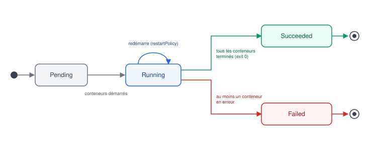

# Pods

## Contexte

Le Pod est la plus petite unité déployable dans Kubernetes. On ne déploie (presque)
jamais un Pod directement en production : on passe par un controller (Deployment,
StatefulSet...) qui gère leur cycle de vie. Mais comprendre le Pod isolément est
indispensable pour tout le reste.

## Notes

### 📦 Définition

Un Pod encapsule un ou plusieurs conteneurs qui :
- partagent le même **network namespace** (même IP, même espace de ports — communication
  entre conteneurs du pod via `localhost`)
- peuvent partager des **volumes**
- sont toujours schedulés ensemble sur le même nœud, démarrés/arrêtés ensemble

Multi-conteneurs dans un pod = pattern **sidecar** (ex. proxy Envoy à côté de l'app,
agent de collecte de logs, init de configuration).

### 🔄 Cycle de vie

*Un pod passe de Pending à Running dès que ses conteneurs démarrent ; Running peut se
redémarrer sur lui-même (restartPolicy) avant de terminer en Succeeded ou Failed.*

| Phase (`status.phase`) | Signification |
|---|---|
| **Pending** | accepté par le cluster mais un ou plusieurs conteneurs pas encore créés (image en cours de pull, scheduling en attente...) |
| **Running** | le pod est lié à un nœud, tous les conteneurs sont créés, au moins un tourne |
| **Succeeded** / **Failed** | tous les conteneurs se sont terminés (utile pour les Jobs) |
| **Unknown** | l'état n'a pas pu être déterminé (souvent perte de communication avec le nœud) |

`restartPolicy` (Always / OnFailure / Never) détermine si kubelet redémarre les conteneurs.

### 🚀 Init containers

Conteneurs exécutés **avant** les conteneurs applicatifs, dans l'ordre, jusqu'à leur
terminaison complète. Cas d'usage typiques :
- attendre qu'une dépendance soit prête (DB, service externe)
- préparer des fichiers de config ou cloner un repo
- appliquer des permissions sur un volume avant que l'app ne démarre

Si un init container échoue, kubelet le redémarre selon `restartPolicy` du pod — les
conteneurs applicatifs ne démarrent jamais tant que tous les init containers n'ont pas
réussi.

### ✅ Ressources et bonnes pratiques

> [!TIP]
> - Toujours définir `resources.requests` et `resources.limits` (CPU/mémoire) : sans ça,
>   le scheduler ne peut pas raisonner correctement et le nœud peut être surchargé.
> - Un pod sans owner (créé directement, pas via Deployment) n'est **pas** recréé s'il est
>   supprimé ou si le nœud tombe → toujours passer par un controller en pratique.
> - Les labels sur les pods sont ce qui permet aux Services et aux controllers de les
>   sélectionner (`selector`).

## Références

- [Pods (doc officielle)](https://kubernetes.io/docs/concepts/workloads/pods/)
- [Init Containers](https://kubernetes.io/docs/concepts/workloads/pods/init-containers/)
