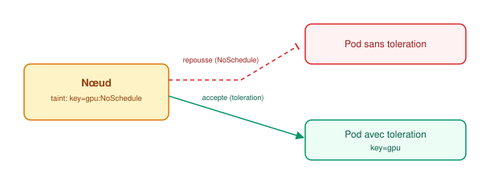

# Scheduling avancé

## Contexte

Le scheduler par défaut place les pods selon les ressources disponibles, mais on peut
affiner (ou forcer) ce placement, et faire varier automatiquement le nombre de pods selon
la charge.

## Notes

### Resources : requests & limits

```yaml
resources:
  requests:
    cpu: "250m"
    memory: "256Mi"
  limits:
    cpu: "500m"
    memory: "512Mi"
```

- **requests** : ce que le scheduler réserve pour choisir un nœud avec assez de capacité
  disponible. Base aussi la classe QoS du pod.
- **limits** : plafond dur appliqué par le kubelet/runtime.
  - CPU : throttling (le conteneur est ralenti, pas tué)
  - Mémoire : **OOMKilled** si dépassement (le conteneur est tué et redémarré)

**Classes QoS** (déterminent l'ordre d'éviction en cas de pression sur le nœud) :
- **Guaranteed** : requests == limits sur CPU et mémoire → jamais évincé en premier
- **Burstable** : requests < limits → évincé après les BestEffort
- **BestEffort** : aucune requests/limits définie → évincé en premier

### Affinity / Anti-affinity

Contrôle **où** un pod peut/doit être placé, par rapport aux nœuds ou aux autres pods.

- **nodeAffinity** : contraint le placement selon les labels des nœuds (ex. type de disque,
  zone). `requiredDuringScheduling` (dur) vs `preferredDuringScheduling` (soft, best-effort).
- **podAffinity** : place un pod **près** d'autres pods (ex. colocaliser une app et son
  cache pour réduire la latence réseau).
- **podAntiAffinity** : évite de placer un pod **avec** certains autres (ex. répartir les
  réplicas d'un Deployment sur des nœuds différents pour la haute disponibilité).

### Taints & Tolerations

Mécanisme inverse de l'affinity : le **nœud** repousse les pods, sauf ceux qui tolèrent
explicitement la contrainte.



Effets d'un taint :
- **NoSchedule** : aucun nouveau pod sans toleration n'est schedulé (les pods déjà présents
  restent)
- **PreferNoSchedule** : soft, évité si possible
- **NoExecute** : les pods déjà présents sans toleration sont **évincés**

Cas d'usage typiques : nœuds GPU dédiés, nœuds control-plane (taint par défaut), nœuds en
maintenance, nœuds dédiés à une équipe/tenant.

### Autoscaling

- **HPA (Horizontal Pod Autoscaler)** : ajuste le nombre de réplicas d'un
  [Deployment](workloads-deployment.md)/[StatefulSet](workloads-statefulset-daemonset.md)
  selon des métriques (CPU/mémoire par défaut, ou métriques custom via Prometheus Adapter).
  Scale horizontal = plus de pods.
- **VPA (Vertical Pod Autoscaler)** : ajuste automatiquement les requests/limits des pods
  selon leur consommation observée. Scale vertical = pods plus gros. Nécessite un
  redémarrage du pod pour appliquer (sauf mode "in-place" encore limité).
- **Cluster Autoscaler** : ajuste le **nombre de nœuds** du cluster selon les pods en
  attente faute de capacité (complémentaire au HPA, agit au niveau infra).

### Points de vigilance

- Sans `requests`/`limits`, le HPA basé sur %CPU ne peut pas fonctionner (il calcule un
  pourcentage de la request).
- `podAntiAffinity` avec `requiredDuringScheduling` trop strict peut bloquer le scheduling
  si pas assez de nœuds disponibles → préférer `preferred` sauf besoin strict de HA.
- Un taint `NoExecute` sans `tolerationSeconds` évince immédiatement — utile pour drainer
  un nœud, dangereux si mal utilisé en prod.

## Références

- [Resource Management for Pods](https://kubernetes.io/docs/concepts/configuration/manage-resources-containers/)
- [Assigning Pods to Nodes](https://kubernetes.io/docs/concepts/scheduling-eviction/assign-pod-node/)
- [Taints and Tolerations](https://kubernetes.io/docs/concepts/scheduling-eviction/taint-and-toleration/)
- [Horizontal Pod Autoscaling](https://kubernetes.io/docs/tasks/run-application/horizontal-pod-autoscale/)
