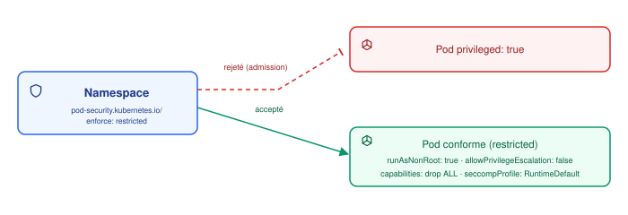

# Sécurité au niveau Pod

## Contexte

Par défaut, un conteneur Kubernetes n'est pas particulièrement restreint : il peut tourner en
`root`, garder des capabilities Linux dangereuses, écrire sur son propre filesystem. Rien de
tout ça n'est automatique à désactiver — c'est à chaque manifeste de le faire explicitement
via `securityContext`.

## Notes

### 🔐 SecurityContext : pod-level vs container-level

Deux niveaux, avec des champs qui se complètent (certains n'existent qu'à un seul niveau) :

```yaml
apiVersion: v1
kind: Pod
metadata:
  name: mon-app
spec:
  securityContext:            # niveau Pod
    runAsUser: 1000
    runAsGroup: 1000
    runAsNonRoot: true
    fsGroup: 2000               # propriétaire des volumes montés
    seccompProfile:
      type: RuntimeDefault      # obligatoire au niveau restricted
  containers:
    - name: mon-app
      image: mon-registre/mon-app:2.4.1
      securityContext:          # niveau conteneur — surcharge le niveau Pod
        allowPrivilegeEscalation: false
        readOnlyRootFilesystem: true
        capabilities:
          drop: ["ALL"]
          add: ["NET_BIND_SERVICE"]   # seulement si vraiment nécessaire
        privileged: false
```

| Champ | Rôle |
|---|---|
| `runAsUser` / `runAsGroup` | UID/GID Linux avec lequel le conteneur tourne |
| `runAsNonRoot: true` | fait **échouer le démarrage** du pod si l'image essaie de tourner en root (UID 0) |
| `fsGroup` | (niveau Pod uniquement) GID appliqué aux volumes montés, pour que le conteneur puisse y écrire sans être root |
| `readOnlyRootFilesystem` | le filesystem du conteneur est en lecture seule — seuls les volumes explicitement montés sont writables |
| `allowPrivilegeEscalation` | empêche un process d'obtenir plus de droits que son parent (ex. via un binaire setuid) |
| `capabilities.drop` / `.add` | capabilities Linux fines (au lieu de "root ou pas root") — `drop: ["ALL"]` puis ajouter seulement ce qui est nécessaire est la pratique recommandée |
| `privileged` | `true` = désactive quasiment tout l'isolement du conteneur, accès direct au matériel du nœud — équivalent root sur l'hôte |
| `seccompProfile.type` | filtre les appels système autorisés. `RuntimeDefault` applique le profil par défaut du runtime ; **obligatoire** pour passer le niveau `restricted` |

> [!CAUTION]
> `privileged: true` n'est pas juste "root dans le conteneur" — c'est un accès quasi total au
> nœud hôte (devices, namespaces noyau). Une évasion de conteneur devient triviale. À réserver
> aux cas qui en ont vraiment besoin (agents CNI, outils de debug bas niveau).

### 🛡️ Pod Security Admission (PSA)

Mécanisme natif (remplace l'ancien `PodSecurityPolicy`, supprimé en 1.25) qui **rejette à
l'admission** les pods qui ne respectent pas un niveau de sécurité, appliqué par **label sur
le namespace** :

```yaml
apiVersion: v1
kind: Namespace
metadata:
  name: prod
  labels:
    pod-security.kubernetes.io/enforce: restricted
    pod-security.kubernetes.io/audit: restricted
    pod-security.kubernetes.io/warn: restricted
```



Trois niveaux (du plus permissif au plus strict) :

| Niveau | Ce qu'il autorise |
|---|---|
| `privileged` | aucune restriction — équivalent à ne rien avoir |
| `baseline` | bloque les cas connus d'évasion (pas de `privileged`, pas de `hostNetwork`/`hostPID` arbitraires...) sans casser la compatibilité |
| `restricted` | applique les bonnes pratiques du champ ci-dessus (`runAsNonRoot`, `capabilities: drop ALL`, `allowPrivilegeEscalation: false`, `seccompProfile: RuntimeDefault`...) — un pod sans `seccompProfile` est rejeté |

Les trois modes (`enforce`/`audit`/`warn`) sont indépendants : `enforce` bloque réellement,
`audit` journalise sans bloquer, `warn` affiche un avertissement à `kubectl apply` — utile
pour tester `restricted` avant de l'imposer.

### 🎫 ServiceAccount

Chaque pod tourne avec l'identité d'un **ServiceAccount** (par défaut `default` du
namespace), utilisée pour authentifier ses appels à l'apiserver — ce que ce compte a le
droit de faire est ensuite une question de RBAC, documenté dans
[Concepts transverses](../Concepts%20transverses/README.md).

> [!TIP]
> Un pod qui n'a pas besoin d'appeler l'API Kubernetes devrait désactiver le montage
> automatique du token : `automountServiceAccountToken: false` — sinon un token valide traîne
> dans le filesystem du conteneur, exploitable en cas de compromission.

### ⚠️ Points de vigilance

> [!WARNING]
> - `hostPath` + `privileged: true` = accès en écriture au filesystem du nœud → évasion
>   quasi garantie si le conteneur est compromis.
> - `runAsNonRoot: true` seul ne suffit pas si l'**image** elle-même n'a pas d'utilisateur
>   non-root défini (`USER` dans le Dockerfile) — le pod échoue simplement au démarrage.
> - Basculer un namespace existant en `enforce: restricted` peut casser des workloads déjà en
>   place non conformes — toujours tester d'abord en `warn`/`audit`.
> - Les capabilities par défaut d'un conteneur (sans `drop: ["ALL"]`) incluent des choses
>   rarement nécessaires (`NET_RAW` permet de forger des paquets réseau, par exemple).

## Références

- [Configure a Security Context for a Pod or Container](https://kubernetes.io/docs/tasks/configure-pod-container/security-context/)
- [Pod Security Admission](https://kubernetes.io/docs/concepts/security/pod-security-admission/)
- [Pod Security Standards](https://kubernetes.io/docs/concepts/security/pod-security-standards/)
