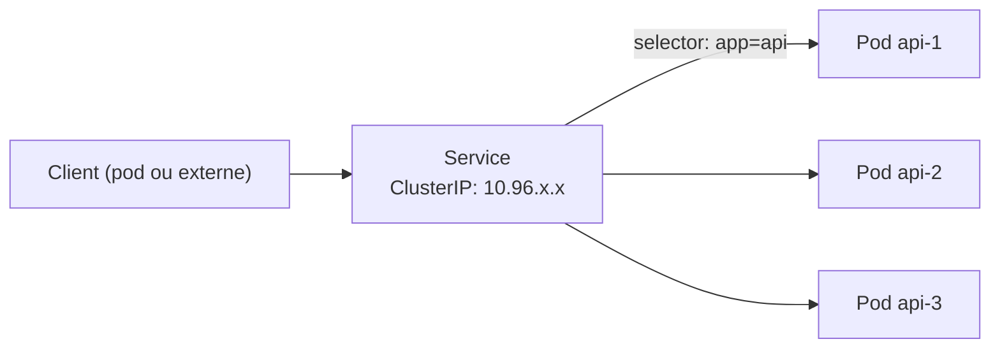

# Services & réseau interne

## Contexte

Les pods sont éphémères et leur IP change à chaque recréation. Le Service fournit un
point d'accès **stable** (IP virtuelle + nom DNS) vers un ensemble de pods, sélectionnés
par labels.

## Notes

### Fonctionnement



Un Service ne route pas activement le trafic lui-même : **kube-proxy**, sur chaque nœud,
maintient des règles (iptables ou IPVS) qui redirigent le trafic vers la ClusterIP directement
vers l'IP d'un des pods backend (load-balancing L4, round-robin par défaut).

L'objet **Endpoints** (ou **EndpointSlice**) liste dynamiquement les IP de pods qui matchent
le `selector` et sont **Ready** (readiness probe OK) — un pod non-ready est automatiquement
retiré de la rotation.

### Types de Service

- **ClusterIP** (défaut) : IP virtuelle interne au cluster uniquement. Usage standard pour
  la communication inter-services.
- **NodePort** : ouvre un port fixe (30000-32767) sur **tous** les nœuds, qui redirige vers
  le Service. Accès externe basique, rarement utilisé en prod directement (préférer
  LoadBalancer ou Ingress).
- **LoadBalancer** : provisionne un load balancer externe via le cloud provider (Azure
  Load Balancer, etc.) qui route vers le Service. Un LB par Service = coûteux à grande
  échelle → voir Ingress pour mutualiser.
- **ExternalName** : simple alias CNAME DNS vers un nom externe, pas de proxying — utile
  pour référencer un service hors cluster (ex. une DB managée) avec un nom interne cohérent.
- **Headless Service** (`clusterIP: None`) : pas d'IP virtuelle unique, le DNS retourne
  directement les IPs de tous les pods matchés. Utilisé avec StatefulSet pour adresser
  chaque pod individuellement.

### DNS interne (CoreDNS)

Chaque Service obtient un nom DNS résolvable depuis n'importe quel pod du cluster :

```
<service-name>.<namespace>.svc.cluster.local
```

Depuis le même namespace, `<service-name>` seul suffit (résolution via search domains).

### Points de vigilance

- Un Service avec un `selector` qui ne matche aucun pod = 0 endpoint = trafic qui échoue
  silencieusement (toujours vérifier `kubectl get endpoints`).
- `targetPort` (port du pod) doit correspondre au port réellement exposé par le conteneur,
  distinct de `port` (port exposé par le Service).
- Le load-balancing de kube-proxy est niveau **connexion TCP**, pas requête HTTP : une
  connexion persistante (keep-alive, gRPC) reste sur le même pod backend tant qu'elle est
  ouverte — peut créer un déséquilibre de charge.

## Références

- [Service (doc officielle)](https://kubernetes.io/docs/concepts/services-networking/service/)
- [DNS for Services and Pods](https://kubernetes.io/docs/concepts/services-networking/dns-pod-service/)
