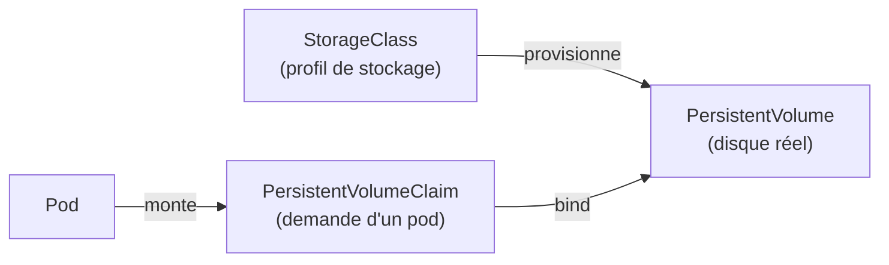

# Stockage : Volumes, PV, PVC, StorageClass

## Contexte

Les conteneurs ont un système de fichiers éphémère par défaut (perdu à chaque recréation).
Kubernetes découple **la demande de stockage** (par l'appli) de **la fourniture de
stockage** (par la plateforme), via un système en couches.

## Notes

### Les couches

- **Volume** (simple) : lié au cycle de vie du **pod**. Survit aux redémarrages de
  conteneurs dans le pod, mais disparaît avec le pod. Types courants : `emptyDir`
  (scratch space temporaire), `hostPath` (déconseillé en prod, dépend du nœud), volumes
  projetés depuis ConfigMap/Secret.
- **PersistentVolume (PV)** : ressource de stockage au niveau du **cluster**, indépendante
  du cycle de vie d'un pod. Représente un disque réel (Azure Disk, Azure Files, NFS...).
  Créé soit manuellement (static provisioning), soit automatiquement par une StorageClass
  (dynamic provisioning — le cas quasi systématique en pratique).
- **PersistentVolumeClaim (PVC)** : demande de stockage faite par un utilisateur/pod
  (taille, mode d'accès). Kubernetes lie (bind) le PVC au PV qui correspond le mieux.
- **StorageClass** : définit un "profil" de stockage (type de disque, provisioner, politique
  de rétention) que les PVC peuvent référencer pour du provisioning **dynamique** — plus
  besoin de créer les PV à la main.

### Modes d'accès (PV/PVC)

- **ReadWriteOnce (RWO)** : monté en lecture/écriture par un seul nœud à la fois (le cas le
  plus courant, ex. Azure Disk).
- **ReadOnlyMany (ROX)** : monté en lecture seule par plusieurs nœuds.
- **ReadWriteMany (RWX)** : monté en lecture/écriture par plusieurs nœuds simultanément
  (nécessite un backend qui le supporte, ex. Azure Files/NFS — pas Azure Disk).
- **ReadWriteOncePod (RWOP)** : RWO mais restreint à un seul **pod** (pas juste un nœud) —
  plus strict, évite les conflits multi-pods sur le même nœud.

### Politique de récupération (`reclaimPolicy`)

Que devient le PV quand son PVC est supprimé :
- **Delete** (défaut avec provisioning dynamique) : le disque sous-jacent est détruit
- **Retain** : le disque est conservé (mais passe en état "Released", pas réutilisable
  directement) — permet une récupération manuelle des données
- **Recycle** : déprécié

### Points de vigilance

- Un PVC en attente (`Pending`) souvent dû à : aucune StorageClass ne matche, mode d'accès
  non supporté par le backend, ou zone Azure incompatible avec le nœud (Azure Disk est
  zone-bound).
- Redimensionner un PVC (`allowVolumeExpansion: true` sur la StorageClass) est possible pour
  la plupart des provisioners cloud, mais souvent pas en réduction.
- StatefulSet + `volumeClaimTemplates` = un PVC dédié par pod, créé automatiquement, jamais
  supprimé automatiquement (protection contre perte de données accidentelle).

## Références

- [Volumes (doc officielle)](https://kubernetes.io/docs/concepts/storage/volumes/)
- [Persistent Volumes](https://kubernetes.io/docs/concepts/storage/persistent-volumes/)
- [Storage Classes](https://kubernetes.io/docs/concepts/storage/storage-classes/)
