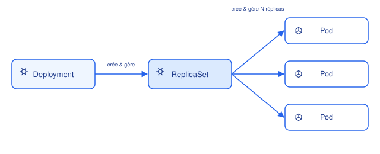

# Deployment & ReplicaSet

## Contexte

Le Deployment est le controller le plus utilisé pour des applications **stateless**. Il
gère indirectement les Pods via un ReplicaSet intermédiaire, ce qui permet les mises à
jour progressives (rolling updates) et les rollbacks.

## Notes

### Hiérarchie

- **ReplicaSet** : garantit qu'un nombre donné de réplicas d'un pod tourne à tout moment.
  Si un pod meurt, le ReplicaSet en recrée un. On ne le manipule quasiment jamais
  directement.
- **Deployment** : gère les ReplicaSets. À chaque changement de `template` (nouvelle image,
  nouvelle config), il crée un **nouveau** ReplicaSet et bascule progressivement les pods
  de l'ancien vers le nouveau.

### Stratégies de déploiement

- **RollingUpdate** (par défaut) : remplace les pods progressivement, contrôlé par
  `maxUnavailable` et `maxSurge`. Zéro downtime si les probes readiness sont bien
  configurées.
- **Recreate** : tue tous les anciens pods avant de créer les nouveaux (downtime, mais
  utile si l'ancienne et la nouvelle version ne peuvent pas cohabiter, ex. migration DB
  incompatible).

### Rollback

Chaque révision de Deployment est conservée (historique via `kubectl rollout history`).
`kubectl rollout undo` revient à la révision précédente en recréant l'ancien ReplicaSet
(ou en le rescalant s'il existe encore).

### Points de vigilance

- `replicas` définit le nombre désiré, mais le vrai contrôle du "combien de pods à la
  fois" pendant une mise à jour vient de `maxSurge`/`maxUnavailable`.
- Un Deployment sans `readinessProbe` correcte peut router du trafic vers des pods pas
  encore prêts pendant un rollout.
- `revisionHistoryLimit` contrôle combien d'anciens ReplicaSets sont gardés (pour
  rollback) — par défaut 10.

## Références

- [Deployments (doc officielle)](https://kubernetes.io/docs/concepts/workloads/controllers/deployment/)
- [ReplicaSet (doc officielle)](https://kubernetes.io/docs/concepts/workloads/controllers/replicaset/)
