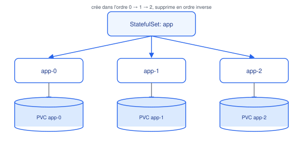

# StatefulSet & DaemonSet

## Contexte

Deux controllers pour des besoins que le Deployment ne couvre pas : les applications
**stateful** (bases de données, brokers de messages) et les daemons **exécutés sur chaque
nœud** (agents de monitoring, CNI, log collectors).

## Notes

### StatefulSet

Utilisé quand les pods ont besoin :
- d'une **identité réseau stable** : nom de pod prévisible (`app-0`, `app-1`, `app-2`,
  toujours pareil même après recréation), utilisable comme hostname DNS stable via un
  Headless Service.
- d'un **stockage persistant dédié** : chaque pod obtient son propre PVC (via
  `volumeClaimTemplates`), qui lui reste attaché même s'il est recréé sur un autre nœud.
- d'un **ordre de démarrage/arrêt garanti** : création séquentielle `0, 1, 2...`, suppression
  dans l'ordre inverse. Utile pour les clusters à état (ex. un maître doit démarrer avant
  les réplicas dans certains systèmes).

Cas d'usage typiques : bases de données (PostgreSQL, MongoDB en cluster), Kafka,
Elasticsearch, Zookeeper.

### DaemonSet

Garantit qu'une copie d'un pod tourne sur **chaque nœud** du cluster (ou sur un sous-ensemble
via `nodeSelector`/affinity). Quand un nœud est ajouté, le pod y est automatiquement créé ;
quand un nœud est retiré, le pod est nettoyé.

Cas d'usage typiques :
- agents de logs (Fluentd, Filebeat)
- agents de monitoring (node-exporter Prometheus)
- plugins réseau (CNI) et de stockage au niveau nœud
- agents de sécurité (scanners, EDR)

### Différence clé avec Deployment

| | Deployment | StatefulSet | DaemonSet |
|---|---|---|---|
| Identité des pods | interchangeable | stable et unique | un par nœud |
| Stockage | partagé ou aucun | dédié par pod | souvent hostPath/local |
| Scaling | `replicas` arbitraire | `replicas` ordonné | = nombre de nœuds éligibles |

## Références

- [StatefulSets (doc officielle)](https://kubernetes.io/docs/concepts/workloads/controllers/statefulset/)
- [DaemonSet (doc officielle)](https://kubernetes.io/docs/concepts/workloads/controllers/daemonset/)
